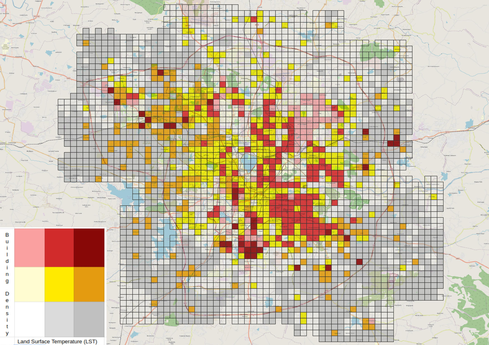

# Where to paint white?
Blog link: [Link](https://dsaikrishna.wordpress.com/2023/04/06/where-to-paint-white/)

Minister KTR has announced the [cool roof policy](https://www.telangana.gov.in/PDFDocuments/Telangana-Cool-Roof-Policy-2023-2028.pdf) to deal with the problem of increasing temperatures in the city. Putting it simply, he plans to paint many roofs white colour so as to reflect back some sunlight back to space. [Read about albedo for more details.](https://mynasadata.larc.nasa.gov/mini-lessonactivity/what-albedo)

The government’s initial target is to paint roofs of 5 sq. km area by March 2024. Let’s see which area would be the best to do this.

While many variables can be used to make this decision, I choose the Building Density and the Land Surface Temperature (May) to begin with. Here is a [bi-variate choropleth](https://www.joshuastevens.net/cartography/make-a-bivariate-choropleth-map/) (showing both variables on a single map)

Each grid in the picture is of 1 sq. km area. We can see a cluster of grids in the Balapur area that can be prioritised for phase 1 of the cool roof policy. This is the area with high Land Surface Temperature and high Building Density. Surrounding red coloured cluster as well.

Of course, other variables could also be considered (like income) in prioritisation. We can choose well-off areas from the red regions of the map to ensure that the policy is not a burden to the poor. Nevertheless, we are now in a better position to decide which part of the city should be painted white 🙂

Let’s see where the government paints and compare the rationale.

## Feedback/Comments

The [lost_sparrow](https://twitter.com/cap_lostsparrow) raised an interesting fact on Twitter:

`Due to rough finishing of  the surfaces , it may probably scatter  the  light than reflect it . In the areas with variable roof heights, people living in higher floors may need to buy blinders and goggles to save their  eyes? (Akin to snow blindness )`